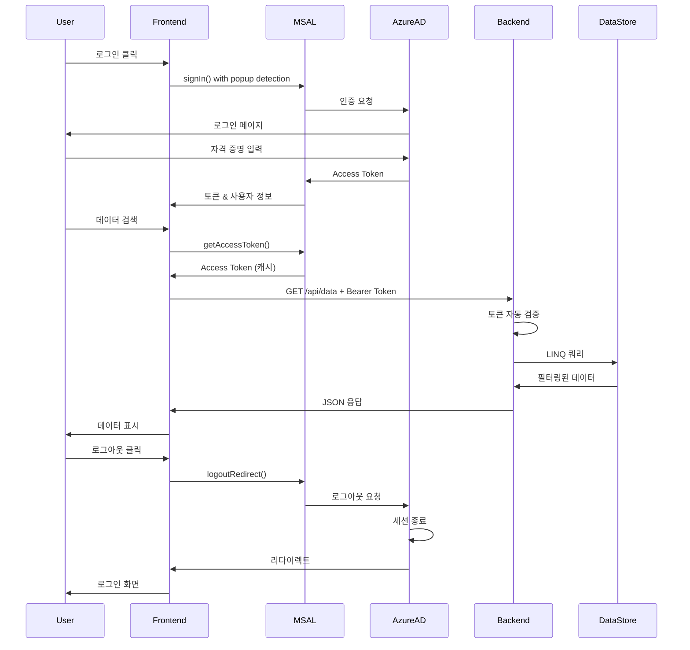

# Azure OAuth 인증 플로우 상세 코드 분석

## 📋 목차
1. [전체 아키텍처 개요](#전체-아키텍처-개요)
2. [현재 구성 상태](#현재-구성-상태)
3. [Frontend: Azure AD 로그인 프로세스](#1-frontend-azure-ad-로그인-프로세스)
4. [Frontend: 토큰 획득 및 관리](#2-frontend-토큰-획득-및-관리)
5. [Frontend → Backend: API 호출 과정](#3-frontend--backend-api-호출-과정)
6. [Backend: 토큰 검증 프로세스](#4-backend-토큰-검증-프로세스)
7. [Backend: 데이터 처리](#5-backend-데이터-처리)
8. [로그아웃 프로세스](#6-로그아웃-프로세스)
9. [데이터베이스 구조](#7-데이터베이스-구조)

---

## 전체 아키텍처 개요

```
[사용자] → [Frontend (MSAL.js)] → [Azure AD] → [Access Token]
                     ↓
              [API 호출 with Token]
                     ↓
        [Backend (Microsoft.Identity.Web)]
                     ↓
              [토큰 자동 검증]
                     ↓
              [데이터 처리 및 반환]
```

이 시스템은 Azure AD 토큰을 직접 사용하여 API를 보호합니다. 별도의 JWT 생성이나 Refresh Token 관리가 필요 없습니다.

---

## 현재 구성 상태

### ⚠️ 중요: 현재 과도기 상태

현재 이 애플리케이션은 Azure Portal에서 API가 제대로 노출되지 않은 상태로 실행 중입니다. 따라서 임시로 Microsoft Graph 스코프를 사용하고 있습니다.

**현재 구성**:
- **Client ID**: `70a3cf75-694b-463d-a658-011195fc1f9d`
- **Tenant ID**: `6c01af9b-e68a-4616-bcc6-4685d9acd910`
- **임시 스코프**: `User.Read` (Microsoft Graph)
- **목표 스코프**: `api://70a3cf75-694b-463d-a658-011195fc1f9d/access_as_user`

**필요한 Azure Portal 설정**:
1. API 노출 설정 (Expose an API)
2. Application ID URI 설정: `api://70a3cf75-694b-463d-a658-011195fc1f9d`
3. 스코프 추가: `access_as_user`

자세한 설정 방법은 `AZURE_SETUP_GUIDE.md` 참조

---

## 1. Frontend: Azure AD 로그인 프로세스

### 1.1 MSAL 초기화
**파일**: `/Frontend/auth.js`

```javascript
// MSAL 인스턴스 생성 - Azure AD와 통신할 클라이언트 생성
const msalInstance = new msal.PublicClientApplication(msalConfig);

// 초기화 함수 - 페이지 로드 시 실행
async function initializeMsal() {
    try {
        // Azure AD에서 리다이렉트로 돌아온 경우 처리
        const response = await msalInstance.handleRedirectPromise();
        if (response && response.account) {
            currentAccount = response.account;
            msalInstance.setActiveAccount(response.account);
        }

        // 이미 로그인된 사용자 확인
        const accounts = msalInstance.getAllAccounts();
        if (accounts.length > 0) {
            currentAccount = accounts[0];
            msalInstance.setActiveAccount(accounts[0]);
        }

        return currentAccount;
    } catch (error) {
        console.error("MSAL initialization error:", error);
        return null;
    }
}
```

**설명**: 
- 페이지 로드 시 MSAL을 초기화하고 이미 로그인된 사용자가 있는지 확인
- sessionStorage에 캐시된 토큰 정보를 자동으로 로드

### 1.2 팝업 감지 로직
**파일**: `/Frontend/auth.js`

```javascript
// 팝업/iframe 내에서 실행 중인지 확인
function isRunningInPopup() {
    try {
        return window.opener !== null || window !== window.parent || window !== window.top;
    } catch (e) {
        return true;
    }
}
```

**설명**:
- 현재 코드가 팝업이나 iframe 내에서 실행되고 있는지 감지
- 팝업 내에서 또 다른 팝업을 열 수 없기 때문에 필수적인 검사
- 감지된 경우 리다이렉트 방식으로 자동 전환

### 1.3 로그인 실행
**파일**: `/Frontend/auth.js`

```javascript
// 지능형 로그인 - 팝업 우선, 실패 시 리다이렉트
async function signIn() {
    // 이미 팝업 내부인 경우 리다이렉트 사용
    if (isRunningInPopup()) {
        console.log("Running in popup/iframe, using redirect");
        await msalInstance.loginRedirect(loginRequest);
        return;
    }
    
    try {
        // 1단계: 팝업으로 로그인 시도
        const response = await msalInstance.loginPopup(loginRequest);
        currentAccount = response.account;
        msalInstance.setActiveAccount(response.account);
        return response.account;
    } catch (popupError) {
        // 2단계: 팝업이 차단된 경우 리다이렉트로 전환
        console.log("Popup blocked or failed:", popupError.errorCode);
        await msalInstance.loginRedirect(loginRequest);
    }
}

// 강제 리다이렉트 로그인 옵션
async function signInWithRedirect() {
    console.log("Using redirect for sign in");
    await msalInstance.loginRedirect(loginRequest);
}
```

**설명**:
- `signIn()`: 지능형 로그인 - 팝업 시도 후 실패 시 리다이렉트
- `signInWithRedirect()`: 항상 리다이렉트 방식 사용
- 팝업 차단기를 우회하는 폴백 메커니즘 포함

### 1.4 로그인 요청 구성
**파일**: `/Frontend/config.js`

```javascript
// 현재 구성 (임시 - Microsoft Graph 스코프 사용)
const loginRequest = {
    scopes: [
        "openid",           // OpenID Connect 기본 스코프
        "profile",          // 사용자 프로필 정보
        "email",            // 이메일 정보
        "User.Read"         // Microsoft Graph 스코프 (임시)
    ]
};

// API 호출용 토큰 요청 구성
const tokenRequest = { 
    scopes: ["api://70a3cf75-694b-463d-a658-011195fc1f9d/access_as_user"]  // 목표 스코프
};
```

**참고**: 현재 loginRequest는 Microsoft Graph 스코프를 사용하지만, API가 제대로 노출되면 tokenRequest의 스코프를 사용해야 합니다.

---

## 2. Frontend: 토큰 획득 및 관리

### 2.1 토큰 획득 로직
**파일**: `/Frontend/auth.js`

```javascript
async function getAccessToken() {
    if (!currentAccount) {
        throw new Error("No user signed in");
    }

    const request = {
        ...tokenRequest,  // API 스코프 사용 시도
        account: currentAccount
    };

    try {
        // 1단계: Silent 토큰 획득 (캐시에서)
        const response = await msalInstance.acquireTokenSilent(request);
        return response.accessToken;
    } catch (error) {
        console.log("Silent token acquisition failed");
        
        // 팝업 내부에서 실행 중인지 확인
        if (isRunningInPopup()) {
            console.log("Running in popup/iframe, using redirect for token acquisition");
            await msalInstance.acquireTokenRedirect(request);
            return;
        }
        
        try {
            // 2단계: Silent 실패 시 팝업으로 재인증
            const response = await msalInstance.acquireTokenPopup(request);
            return response.accessToken;
        } catch (popupError) {
            // 3단계: 팝업도 실패 시 리다이렉트
            console.log("Popup failed, acquiring via redirect");
            await msalInstance.acquireTokenRedirect(request);
        }
    }
}
```

**토큰 획득 우선순위**:
1. **Silent** (acquireTokenSilent): 캐시된 토큰 사용, 사용자 상호작용 없음
2. **Popup** (acquireTokenPopup): 팝업 창으로 재인증 (팝업 내부가 아닌 경우만)
3. **Redirect** (acquireTokenRedirect): 전체 페이지 리다이렉트로 재인증

### 2.2 토큰 디코딩
**파일**: `/Frontend/auth.js`

```javascript
function decodeToken(token) {
    try {
        const parts = token.split('.');
        const header = JSON.parse(atob(parts[0]));
        const payload = JSON.parse(atob(parts[1]));
        
        return {
            header,
            payload,
            expires: new Date(payload.exp * 1000),  // Unix timestamp를 Date로 변환
            issued: new Date(payload.iat * 1000)
        };
    } catch (error) {
        console.error("Token decode error:", error);
        return null;
    }
}
```

**토큰 구조**:
- **Header**: 알고리즘 및 토큰 타입 정보
- **Payload**: 사용자 정보, 권한, 만료 시간 등
- **Signature**: Azure AD의 디지털 서명 (검증용)

---

## 3. Frontend → Backend: API 호출 과정

### 3.1 인증된 요청 생성
**파일**: `/Frontend/auth.js`

```javascript
async function makeAuthenticatedRequest(url, options = {}) {
    try {
        // 토큰 획득
        const token = await getAccessToken();
        
        // Bearer 토큰을 Authorization 헤더에 추가
        const response = await fetch(url, {
            ...options,
            headers: {
                ...options.headers,
                'Authorization': `Bearer ${token}`,  // Azure AD 토큰
                'Content-Type': 'application/json'
            }
        });

        if (response.status === 401) {
            // 토큰 만료 시 재시도
            msalInstance.clearCache();
            const newToken = await getAccessToken();
            
            return fetch(url, {
                ...options,
                headers: {
                    ...options.headers,
                    'Authorization': `Bearer ${newToken}`,
                    'Content-Type': 'application/json'
                }
            });
        }

        return response;
    } catch (error) {
        console.error("API request failed:", error);
        throw error;
    }
}
```

### 3.2 데이터 검색 요청
**파일**: `/Frontend/app.js`

```javascript
async function loadData(search = '') {
    try {
        dataResults.innerHTML = '<div class="loading">Loading data...</div>';
        
        // 검색어가 있으면 쿼리 파라미터 추가
        const url = search 
            ? `${apiConfig.baseUrl}/data?search=${encodeURIComponent(search)}`
            : `${apiConfig.baseUrl}/data`;
            
        // 인증된 요청 실행
        const response = await makeAuthenticatedRequest(url);
        
        if (!response.ok) {
            throw new Error('Failed to load data');
        }
        
        const data = await response.json();
        displayData(data);
        
    } catch (error) {
        dataResults.innerHTML = '<div class="error">Failed to load data. Please try again.</div>';
        showMessage('Error loading data: ' + error.message, 'error');
    }
}
```

---

## 4. Backend: 토큰 검증 프로세스

### 4.1 Azure AD 인증 설정
**파일**: `/Backend/AzureOAuthAPI/Program.cs`

```csharp
using Microsoft.AspNetCore.Authentication.JwtBearer;
using Microsoft.Identity.Web;

var builder = WebApplication.CreateBuilder(args);

// Azure AD 인증 구성
builder.Services.AddAuthentication(JwtBearerDefaults.AuthenticationScheme)
    .AddMicrosoftIdentityWebApi(builder.Configuration.GetSection("AzureAd"));

// 미들웨어 파이프라인에 인증 추가
app.UseAuthentication();  // 토큰 검증
app.UseAuthorization();   // 권한 확인
```

**자동 검증 프로세스**:
1. **토큰 추출**: Authorization 헤더에서 Bearer 토큰 추출
2. **서명 검증**: Azure AD 공개 키로 토큰 서명 검증
3. **발급자 검증**: 토큰이 올바른 Azure AD 테넌트에서 발급되었는지 확인
4. **대상 검증**: Audience가 이 API인지 확인
5. **만료 시간 검증**: 토큰이 유효한 시간 내에 있는지 확인

### 4.2 Azure AD 구성
**파일**: `/Backend/AzureOAuthAPI/appsettings.json`

```json
{
  "AzureAd": {
    "Instance": "https://login.microsoftonline.com/",
    "Domain": "your-domain.onmicrosoft.com",  // 실제 도메인으로 변경 필요
    "TenantId": "6c01af9b-e68a-4616-bcc6-4685d9acd910",
    "ClientId": "70a3cf75-694b-463d-a658-011195fc1f9d",
    "Audience": "api://70a3cf75-694b-463d-a658-011195fc1f9d",
    "SignedOutCallbackPath": "/signout-callback-oidc"
  }
}
```

---

## 5. Backend: 데이터 처리

### 5.1 컨트롤러 보호
**파일**: `/Backend/AzureOAuthAPI/Controllers/DataController.cs`

```csharp
[Authorize]  // 모든 액션에 인증 필요
[ApiController]
[Route("api/[controller]")]
public class DataController : ControllerBase
{
    private readonly ILogger<DataController> _logger;

    // In-Memory 데이터 저장소
    private static readonly List<DataItem> _dataItems = new()
    {
        new DataItem { Id = 1, Title = "Azure AD Integration", ... },
        new DataItem { Id = 2, Title = "RESTful API Design", ... },
        new DataItem { Id = 3, Title = "Cloud Architecture", ... },
        new DataItem { Id = 4, Title = "Microservices Pattern", ... },
        new DataItem { Id = 5, Title = "DevOps Pipeline", ... }
    };
```

### 5.2 데이터 검색 로직 (GET)
```csharp
[HttpGet]
public IActionResult GetAll([FromQuery] string? search = null)
{
    // 토큰에서 사용자 정보 추출
    var userEmail = User.FindFirst(ClaimTypes.Email)?.Value ?? 
                   User.FindFirst("preferred_username")?.Value;
    
    _logger.LogInformation("Data requested by user {Email}", userEmail);

    // LINQ로 데이터 필터링
    var items = _dataItems.AsEnumerable();

    if (!string.IsNullOrWhiteSpace(search))
    {
        items = items.Where(d => 
            d.Title.Contains(search, StringComparison.OrdinalIgnoreCase) ||
            d.Description.Contains(search, StringComparison.OrdinalIgnoreCase) ||
            d.Category.Contains(search, StringComparison.OrdinalIgnoreCase));
    }

    return Ok(items);
}
```

### 5.3 개별 항목 조회 (GET by ID)
```csharp
[HttpGet("{id}")]
public IActionResult GetById(int id)
{
    var item = _dataItems.FirstOrDefault(d => d.Id == id);
    
    if (item == null)
    {
        return NotFound(new { message = "Data item not found" });
    }

    return Ok(item);
}
```

### 5.4 새 항목 생성 (POST)
```csharp
[HttpPost]
public IActionResult Create([FromBody] CreateDataItemRequest request)
{
    if (string.IsNullOrWhiteSpace(request.Title))
    {
        return BadRequest(new { message = "Title is required" });
    }

    var newItem = new DataItem
    {
        Id = _dataItems.Max(d => d.Id) + 1,
        Title = request.Title,
        Description = request.Description ?? string.Empty,
        Category = request.Category ?? "General",
        CreatedBy = User.FindFirst(ClaimTypes.Email)?.Value ?? "Unknown",
        CreatedAt = DateTime.UtcNow
    };

    _dataItems.Add(newItem);
    
    _logger.LogInformation("New data item created: {Title}", newItem.Title);

    return CreatedAtAction(nameof(GetById), new { id = newItem.Id }, newItem);
}
```

### 5.5 항목 삭제 (DELETE)
```csharp
[HttpDelete("{id}")]
public IActionResult Delete(int id)
{
    var item = _dataItems.FirstOrDefault(d => d.Id == id);
    
    if (item == null)
    {
        return NotFound(new { message = "Data item not found" });
    }

    _dataItems.Remove(item);
    
    _logger.LogInformation("Data item deleted: {Title}", item.Title);

    return NoContent();
}
```

### 5.6 사용자 정보 엔드포인트
**파일**: `/Backend/AzureOAuthAPI/Controllers/UserController.cs`

```csharp
[HttpGet("profile")]
public IActionResult GetProfile()
{
    // User 객체에서 클레임 정보 추출
    var userId = User.FindFirst(ClaimTypes.NameIdentifier)?.Value;
    var email = User.FindFirst(ClaimTypes.Email)?.Value ?? 
               User.FindFirst("preferred_username")?.Value;
    var name = User.FindFirst(ClaimTypes.Name)?.Value ?? 
              User.FindFirst("name")?.Value;
    
    return Ok(new
    {
        id = userId,
        email = email,
        name = name,
        authenticated = true,
        claims = User.Claims.Select(c => new { c.Type, c.Value })
    });
}

[HttpGet("validate")]
public IActionResult ValidateToken()
{
    // 토큰 유효성 확인용 간단한 엔드포인트
    return Ok(new
    {
        authenticated = true,
        timestamp = DateTime.UtcNow
    });
}
```

---

## 6. 로그아웃 프로세스

### 6.1 Frontend 로그아웃
**파일**: `/Frontend/auth.js`

```javascript
async function signOut() {
    const logoutRequest = {
        account: currentAccount,
        postLogoutRedirectUri: window.location.origin  // 로그아웃 후 돌아올 URL
    };
    
    // Azure AD 로그아웃 페이지로 리다이렉트
    await msalInstance.logoutRedirect(logoutRequest);
}
```

### 6.2 로그아웃 프로세스 순서

**프로세스 순서**:
1. **로그아웃 시작**: `signOut()` 함수 호출
2. **Azure AD 리다이렉트**: `https://login.microsoftonline.com/.../logout` 페이지로 이동
3. **Azure AD 세션 종료**: Azure AD에서 사용자 세션 삭제
4. **토큰 무효화**: 발급된 모든 토큰이 Azure AD에서 무효화됨
5. **Frontend 리다이렉트**: `postLogoutRedirectUri`로 돌아옴
6. **로컬 캐시 정리**: MSAL이 sessionStorage의 토큰 캐시 자동 삭제
7. **UI 업데이트**: 로그인 화면으로 전환

---

## 7. 데이터베이스 구조

### 7.1 현재 구현: In-Memory Storage

**실제 SQL Database가 없는 이유**:
- 데모 및 프로토타입 목적
- 빠른 개발과 테스트
- 외부 의존성 최소화

**파일**: `/Backend/AzureOAuthAPI/Controllers/DataController.cs`

```csharp
// 데이터 모델
public class DataItem
{
    public int Id { get; set; }
    public string Title { get; set; } = string.Empty;
    public string Description { get; set; } = string.Empty;
    public string Category { get; set; } = string.Empty;
    public string? CreatedBy { get; set; }
    public DateTime CreatedAt { get; set; } = DateTime.UtcNow;
}

// 요청 모델
public class CreateDataItemRequest
{
    public string Title { get; set; } = string.Empty;
    public string? Description { get; set; }
    public string? Category { get; set; }
}
```

### 7.2 SQL Database 구조 (프로덕션 권장)

만약 실제 SQL Database를 사용한다면:

```sql
-- Users 테이블 (Azure AD 사용자 정보 캐싱)
CREATE TABLE Users (
    Id INT PRIMARY KEY IDENTITY(1,1),
    AzureId NVARCHAR(255) UNIQUE NOT NULL,  -- Azure AD Object ID
    Email NVARCHAR(255) NOT NULL,
    DisplayName NVARCHAR(255),
    CreatedAt DATETIME2 DEFAULT GETUTCDATE(),
    LastLoginAt DATETIME2
);

-- DataItems 테이블 (실제 데이터)
CREATE TABLE DataItems (
    Id INT PRIMARY KEY IDENTITY(1,1),
    Title NVARCHAR(200) NOT NULL,
    Description NVARCHAR(MAX),
    Category NVARCHAR(50),
    CreatedBy INT FOREIGN KEY REFERENCES Users(Id),
    CreatedAt DATETIME2 DEFAULT GETUTCDATE(),
    UpdatedAt DATETIME2,
    IsDeleted BIT DEFAULT 0
);

-- 검색 성능을 위한 인덱스
CREATE INDEX IX_DataItems_Title ON DataItems(Title);
CREATE INDEX IX_DataItems_Category ON DataItems(Category);
CREATE INDEX IX_DataItems_CreatedBy ON DataItems(CreatedBy);
```

---

## 📊 전체 플로우 다이어그램



---

## 🔑 핵심 포인트 요약

### 인증 메커니즘
1. **Azure AD가 모든 인증 처리**: 사용자 관리, 토큰 발급, 검증 모두 Azure AD 담당
2. **토큰 직접 사용**: Azure AD 토큰을 그대로 API 인증에 사용
3. **자동 갱신**: MSAL.js가 토큰 만료 전 자동 갱신
4. **팝업 감지 로직**: 중첩된 팝업 방지를 위한 지능형 인증 흐름

### 보안 특징
1. **서명 검증**: Microsoft.Identity.Web이 자동으로 토큰 서명 검증
2. **CORS 보호**: localhost:3000만 API 호출 허용
3. **클레임 기반 인증**: 토큰의 클레임으로 사용자 식별

### 현재 제한사항
1. **API 노출 미완성**: Azure Portal에서 API 노출 설정 필요
2. **In-Memory 데이터**: 서버 재시작 시 데이터 손실
3. **단일 테넌트**: 현재 설정은 하나의 Azure AD 테넌트만 지원
4. **도메인 구성 필요**: appsettings.json의 Domain 필드 설정 필요

---

## 🚀 프로덕션 전환 시 필수 작업

1. **Azure Portal 구성 완료**
   - API 노출 설정
   - 올바른 스코프 구성
   - 관리자 동의 부여

2. **데이터베이스 추가**
   - SQL Server 또는 PostgreSQL 도입
   - Entity Framework Core로 데이터 영속성 구현

3. **환경 변수 사용**
   - Azure AD 설정을 환경 변수로 관리
   - Azure Key Vault 연동 고려

4. **보안 강화**
   - HTTPS 적용
   - Rate limiting 구현
   - SQL Injection 방지
